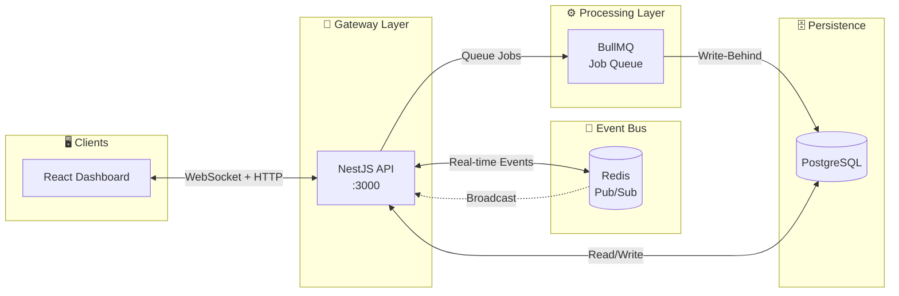

# FluxBoard


<div align="center">

[](https://www.typescriptlang.org/)
[](https://reactjs.org/)
[](https://nestjs.com/)
[](https://tailwindcss.com/)
[](https://www.postgresql.org/)
[](https://redis.io/)
[](https://www.docker.com/)

[](https://opensource.org/licenses/MIT)
[](https://github.com/deyndev/fluxboard/stargazers)
[](https://github.com/deyndev/fluxboard/network/members)
[](https://github.com/deyndev/fluxboard/issues)
[](http://makeapullrequest.com)

</div>

<br />

<p align="center">
  <b>FluxBoard</b> is a production-grade Kanban collaboration platform engineered to demonstrate mastery of concurrency, state management, and distributed systems architecture. It features a "Gemini-inspired" deep space aesthetic and a robust real-time engine.
</p>

---

## 📑 Table of Contents

-   [✨ Key Features](#-key-features)
-   [🏗️ Architecture](#️-architecture)
-   [🛠️ Tech Stack](#️-tech-stack)
-   [🏁 Getting Started](#-getting-started)
-   [🔐 Environment Variables](#-environment-variables)
-   [📦 Project Structure](#-project-structure)
-   [📄 License](#-license)
-   [🤝 Contributing](#-contributing)
-   [🙏 Acknowledgments](#-acknowledgments)

---

## ✨ Key Features

*   **⚡ Real-Time Collaboration**: Sub-millisecond updates across all connected clients via **Socket.io**.
*   **🧠 Optimistic UI**: Instant visual feedback for drag-and-drop actions, ensuring a snappy user experience regardless of network latency.
*   **🔒 Concurrency Control**: Visual locking mechanism prevents race conditions when multiple users edit the same card.
*   **🚀 High-Performance Caching**: Implements a **Write-Behind** strategy using **Redis** and **BullMQ** to buffer high-frequency events before persisting to **PostgreSQL**.
*   **🔢 Efficient Ordering**: Uses the **Lexorank** algorithm for O(1) list reordering, avoiding heavy database updates.
*   **🛡️ Secure Authentication**: Robust JWT-based auth stored in HttpOnly cookies with CSRF protection.
*   **🎨 Premium UX**: Modern interface featuring glassmorphism, aurora gradients, and smooth animations powered by **Framer Motion**.

---

## 🏗️ Architecture

FluxBoard follows a distributed microservices-ready architecture designed for real-time collaboration at scale.



### Data Flow

| Stage | Service | Technology | Responsibility |
| :--- | :--- | :--- | :--- |
| **1. Client** | React Dashboard | React 18 + Socket.io | UI rendering, optimistic updates, real-time subscriptions |
| **2. Gateway** | API Server | NestJS + TypeScript | REST endpoints, WebSocket gateway, authentication |
| **3. Cache** | Hot Storage | Redis | Session storage, pub/sub for multi-instance sync |
| **4. Queue** | Job Processor | BullMQ | Write-behind caching, async persistence |
| **5. Database** | Cold Storage | PostgreSQL | Source of truth, transactional integrity |

---

## 🛠️ Tech Stack

| Component | Technology | Description |
| :--- | :--- | :--- |
| **Frontend** | **React 18** | UI Library with Hooks |
| | **TypeScript** | Static Typing |
| | **Vite** | Next-gen Build Tool |
| | **Tailwind CSS v4** | Utility-first Styling |
| | **Framer Motion** | Animation Library |
| | **@hello-pangea/dnd** | Drag and Drop logic |
| **Backend** | **NestJS** | Progressive Node.js Framework |
| | **Socket.io** | Real-time Engine |
| | **TypeORM** | ORM for PostgreSQL |
| | **BullMQ** | Job Queue for write-behind |
| **Data** | **PostgreSQL** | Relational Database |
| | **Redis** | In-memory Cache & Pub/Sub |
| **DevOps** | **Docker** | Containerization |

---

## 🏁 Getting Started

Follow these steps to set up the project locally.

### Prerequisites

*   **Node.js** (v18 or higher)
*   **Docker** & **Docker Compose**

### Installation

1.  **Clone the repository**
    ```bash
    git clone https://github.com/yourusername/fluxboard.git
    cd fluxboard
    ```

2.  **Start Infrastructure (DB & Cache)**
    ```bash
    docker compose up -d
    ```

3.  **Setup Backend**
    ```bash
    cd backend
    npm install
    cp .env.example .env
    npm run start:dev
    ```
    *The backend server will start on port 3000.*

4.  **Setup Frontend**
    ```bash
    cd ../frontend
    npm install
    npm run dev
    ```
    *The frontend will start on port 5173.*

5.  **Access the App**
    Open [http://localhost:5173](http://localhost:5173) in your browser.

---

## 🔐 Environment Variables

### Backend (`backend/.env`)

| Variable | Description | Default |
| :--- | :--- | :--- |
| `POSTGRES_HOST` | Database host | `localhost` |
| `POSTGRES_PORT` | Database port | `5432` |
| `POSTGRES_USER` | Database user | `flux` |
| `POSTGRES_PASSWORD` | Database password | `password123` |
| `POSTGRES_DB` | Database name | `fluxboard` |
| `REDIS_HOST` | Redis host | `localhost` |
| `REDIS_PORT` | Redis port | `6379` |
| `JWT_SECRET` | Secret for signing tokens | **CHANGE_THIS** |
| `FRONTEND_URL` | CORS Origin URL | `http://localhost:5173` |

---

## 📦 Project Structure

```bash
fluxboard/
├── backend/                 # NestJS API & WebSocket Server
│   ├── src/
│   │   ├── auth/           # Authentication & Guards
│   │   ├── boards/         # Board Domain & Gateways
│   │   ├── cards/          # Card Domain
│   │   ├── columns/        # Column Domain
│   │   ├── redis/          # Redis Integration
│   │   └── users/          # User Management
│   └── ...
├── frontend/                # React Vite Application
│   ├── src/
│   │   ├── api/            # Axios & Socket wrappers
│   │   ├── components/     # Reusable UI Components
│   │   ├── context/        # Global State (Auth)
│   │   ├── pages/          # Route Views
│   │   └── ...
├── docker-compose.yml       # Infrastructure Config
└── README.md                # Documentation
```

---

## 📄 License

This project is licensed under the **MIT License** - see the [LICENSE](LICENSE) file for details.

You are free to use, modify, and distribute this software for any purpose.

---

## 🤝 Contributing

Contributions are what make the open source community such an amazing place to learn, inspire, and create. Any contributions you make are **greatly appreciated**!

1.  Fork the Project
2.  Create your Feature Branch (`git checkout -b feature/AmazingFeature`)
3.  Commit your Changes (`git commit -m 'Add some AmazingFeature'`)
4.  Push to the Branch (`git push origin feature/AmazingFeature`)
5.  Open a Pull Request

---

## 🙏 Acknowledgments

FluxBoard is built on the shoulders of giants. Special thanks to all the open source projects that made this possible:

*   [React](https://reactjs.org/) - A JavaScript library for building user interfaces
*   [NestJS](https://nestjs.com/) - A progressive Node.js framework
*   [TypeScript](https://www.typescriptlang.org/) - Typed JavaScript at Any Scale
*   [Tailwind CSS](https://tailwindcss.com/) - A utility-first CSS framework
*   [Socket.io](https://socket.io/) - Real-time bidirectional event-based communication
*   [PostgreSQL](https://www.postgresql.org/) - The World's Most Advanced Open Source Relational Database
*   [Redis](https://redis.io/) - In-memory data structure store
*   [BullMQ](https://docs.bullmq.io/) - Premium Message Queue for Node.js
*   [Framer Motion](https://www.framer.com/motion/) - A production-ready motion library for React
*   [@hello-pangea/dnd](https://github.com/hello-pangea/dnd) - Beautiful drag and drop for lists
*   [TanStack Query](https://tanstack.com/query) - Powerful asynchronous state management
*   [TypeORM](https://typeorm.io/) - Amazing ORM for TypeScript and JavaScript

---

<div align="center">

### 💻 Made with ❤️ by **deyndev**

[](https://github.com/deyndev)

<br />

[Report Bug](https://github.com/deyndev/fluxboard/issues) · [Request Feature](https://github.com/deyndev/fluxboard/issues)

</div>

